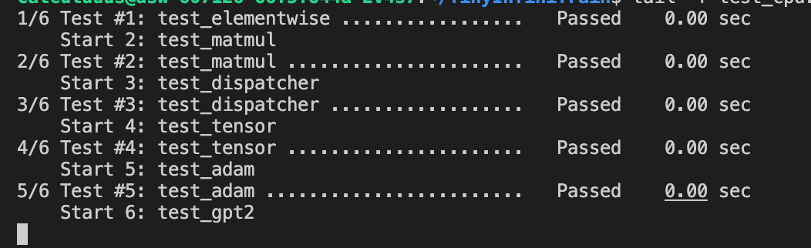

# TinyInfiniTrain 作业报告

## 一、test 通过截图



test6一直在执行，因为没有CUDA资源，cpu执行非常慢，所以没结果

## 二、作业步骤

> 将代码填入下面代码块中指定位置，并详细描述完成该作业的解决思路和遇到的问题。

### 作业一：autograd机制调用Neg kernel的实现

难度：⭐

对应测例：`TEST(ElementwiseTest, NegForward)`，`TEST(ElementwiseTest, NegBackward)`

需要实现的代码块位置：`infini_train/src/autograd/elementwise.cc`

```c++
std::vector<std::shared_ptr<Tensor>> Neg::Forward(const std::vector<std::shared_ptr<Tensor>> &input_tensors) {
    // =================================== 作业 ===================================
    // TODO：通过Dispatcher获取设备专属kernel，对输入张量进行取反操作
    // HINT: 依赖test_dispatcher，kernel实现已给出
    // =================================== 作业 ===================================
    CHECK_EQ(input_tensors.size(), 1);
    const auto &input = input_tensors[0];
    auto device = input->GetDevice().Type();
    auto kernel = Dispatcher::Instance().GetKernel({device, "NegForward"});
    return {kernel.Call<std::shared_ptr<Tensor>>(input)};
}

std::vector<std::shared_ptr<Tensor>> Neg::Backward(const std::vector<std::shared_ptr<Tensor>> &grad_outputs) {
    // =================================== 作业 ===================================
    // TODO：通过Dispatcher获取设备专属的反向传播kernel，计算梯度
    // HINT: 依赖test_dispatcher，kernel实现已给出
    // =================================== 作业 ===================================
    CHECK_EQ(grad_outputs.size(), 1);
    const auto &grad_output = grad_outputs[0];
    auto device = grad_output->GetDevice().Type();
    auto kernel = Dispatcher::Instance().GetKernel({device, "NegBackward"});
    return {kernel.Call<std::shared_ptr<Tensor>>(grad_output)};
}
```

#### 解决思路

这一部分的核心就是把 autograd 的算子封装和 kernel 派发串起来：在 `Neg::Forward/Backward` 里根据输入张量的 device 选择对应的 kernel 名称，然后通过 `Dispatcher` 拿到设备专属 kernel 并调用，最后把得到的输出张量按框架约定返回即可。

#### 遇到问题

无。

### 作业二：实现矩阵乘法

难度：⭐⭐

#### CPU实现

对应测例：`TEST(MatmulTest, BasicMatrixMultiply)`，`TEST(MatmulTest, BatchedMatrixMultiply)`, `TEST(MatmulTest, BackwardPass)`

需要实现的代码块位置：`infini_train/src/kernels/cpu/linear.cc`

```c++
    std::shared_ptr<Tensor> MatmulForward(const std::shared_ptr<Tensor> &input, const std::shared_ptr<Tensor> &other) {
        // =================================== 作业 ===================================
        // TODO：实现CPU上的矩阵乘法前向计算
        // REF:
        // =================================== 作业 ===================================
        CHECK(input);
        CHECK(other);
        CHECK_EQ(static_cast<int>(input->Dtype()), static_cast<int>(DataType::kFLOAT32));
        CHECK_EQ(static_cast<int>(other->Dtype()), static_cast<int>(DataType::kFLOAT32));

        const auto &a_dims = input->Dims();
        const auto &b_dims = other->Dims();
        CHECK_GE(a_dims.size(), 2);
        CHECK_EQ(a_dims.size(), b_dims.size());

        const int64_t ndim = static_cast<int64_t>(a_dims.size());
        for (int64_t i = 0; i < ndim - 2; ++i) {
            CHECK_EQ(a_dims[i], b_dims[i]) << "Batch dim mismatch at dim=" << i;
        }

        const int64_t M = a_dims[ndim - 2];
        const int64_t K = a_dims[ndim - 1];
        CHECK_EQ(K, b_dims[ndim - 2]);
        const int64_t N = b_dims[ndim - 1];

        std::vector<int64_t> out_dims = a_dims;
        out_dims[ndim - 1] = N;
        auto output = std::make_shared<Tensor>(out_dims, DataType::kFLOAT32);

        const int64_t batch
            = (ndim == 2) ? 1 : std::accumulate(a_dims.begin(), a_dims.end() - 2, 1LL, std::multiplies<int64_t>());

        const auto *a_ptr = static_cast<const float *>(input->DataPtr());
        const auto *b_ptr = static_cast<const float *>(other->DataPtr());
        auto *c_ptr = static_cast<float *>(output->DataPtr());

        using MatrixRM = Eigen::Matrix<float, Eigen::Dynamic, Eigen::Dynamic, Eigen::RowMajor>;
        using ConstMap = Eigen::Map<const MatrixRM>;
        using Map = Eigen::Map<MatrixRM>;

        const int64_t a_stride = M * K;
        const int64_t b_stride = K * N;
        const int64_t c_stride = M * N;

        for (int64_t b = 0; b < batch; ++b) {
            ConstMap A(a_ptr + b * a_stride, M, K);
            ConstMap B(b_ptr + b * b_stride, K, N);
            Map C(c_ptr + b * c_stride, M, N);
            C.noalias() = A * B;
        }

        return output;
    }

    std::tuple<std::shared_ptr<Tensor>, std::shared_ptr<Tensor>>
        MatmulBackward(const std::shared_ptr<Tensor> &input, const std::shared_ptr<Tensor> &other,
                    const std::shared_ptr<Tensor> &grad_output) {
        // =================================== 作业 ===================================
        // TODO：实现CPU上的矩阵乘法反向传播
        // REF:
        // =================================== 作业 ===================================
        CHECK(input);
        CHECK(other);
        CHECK(grad_output);
        CHECK_EQ(static_cast<int>(input->Dtype()), static_cast<int>(DataType::kFLOAT32));
        CHECK_EQ(static_cast<int>(other->Dtype()), static_cast<int>(DataType::kFLOAT32));
        CHECK_EQ(static_cast<int>(grad_output->Dtype()), static_cast<int>(DataType::kFLOAT32));

        const auto &a_dims = input->Dims();
        const auto &b_dims = other->Dims();
        const auto &c_dims = grad_output->Dims();
        CHECK_GE(a_dims.size(), 2);
        CHECK_EQ(a_dims.size(), b_dims.size());
        CHECK_EQ(a_dims.size(), c_dims.size());

        const int64_t ndim = static_cast<int64_t>(a_dims.size());
        for (int64_t i = 0; i < ndim - 2; ++i) {
            CHECK_EQ(a_dims[i], b_dims[i]);
            CHECK_EQ(a_dims[i], c_dims[i]);
        }

        const int64_t M = a_dims[ndim - 2];
        const int64_t K = a_dims[ndim - 1];
        CHECK_EQ(K, b_dims[ndim - 2]);
        const int64_t N = b_dims[ndim - 1];

        CHECK_EQ(c_dims[ndim - 2], M);
        CHECK_EQ(c_dims[ndim - 1], N);

        auto grad_input = std::make_shared<Tensor>(a_dims, DataType::kFLOAT32);
        auto grad_other = std::make_shared<Tensor>(b_dims, DataType::kFLOAT32);

        const int64_t batch
            = (ndim == 2) ? 1 : std::accumulate(a_dims.begin(), a_dims.end() - 2, 1LL, std::multiplies<int64_t>());

        const auto *a_ptr = static_cast<const float *>(input->DataPtr());
        const auto *b_ptr = static_cast<const float *>(other->DataPtr());
        const auto *dc_ptr = static_cast<const float *>(grad_output->DataPtr());

        auto *da_ptr = static_cast<float *>(grad_input->DataPtr());
        auto *db_ptr = static_cast<float *>(grad_other->DataPtr());

        using MatrixRM = Eigen::Matrix<float, Eigen::Dynamic, Eigen::Dynamic, Eigen::RowMajor>;
        using ConstMap = Eigen::Map<const MatrixRM>;
        using Map = Eigen::Map<MatrixRM>;

        const int64_t a_stride = M * K;
        const int64_t b_stride = K * N;
        const int64_t c_stride = M * N;

        for (int64_t b = 0; b < batch; ++b) {
            ConstMap A(a_ptr + b * a_stride, M, K);
            ConstMap B(b_ptr + b * b_stride, K, N);
            ConstMap dC(dc_ptr + b * c_stride, M, N);

            Map dA(da_ptr + b * a_stride, M, K);
            Map dB(db_ptr + b * b_stride, K, N);

            dA.noalias() = dC * B.transpose();
            dB.noalias() = A.transpose() * dC;
        }

        return {grad_input, grad_other};
    }
```

#### CUDA实现

对应测例：`TEST(MatmulTest, BasicMatrixMultiplyCuda)`,`TEST(MatmulTest, BatchedMatrixMultiplyCuda)`,`TEST(MatmulTest, BackwardPassCuda)`

需要实现的代码块位置：`infini_train/src/kernels/cuda/linear.cu`

```c++
    std::shared_ptr<Tensor> MatmulForward(const std::shared_ptr<Tensor> &input, const std::shared_ptr<Tensor> &other) {
        // =================================== 作业 ===================================
        // TODO：实现CUDA上的矩阵乘法前向计算
        // REF:
        // =================================== 作业 ===================================
        CHECK(input);
        CHECK(other);
        CHECK_EQ(static_cast<int>(input->Dtype()), static_cast<int>(DataType::kFLOAT32));
        CHECK_EQ(static_cast<int>(other->Dtype()), static_cast<int>(DataType::kFLOAT32));

        const auto &a_dims = input->Dims();
        const auto &b_dims = other->Dims();
        CHECK_GE(a_dims.size(), 2);
        CHECK_EQ(a_dims.size(), b_dims.size());

        const int64_t ndim = static_cast<int64_t>(a_dims.size());
        for (int64_t i = 0; i < ndim - 2; ++i) {
            CHECK_EQ(a_dims[i], b_dims[i]) << "Batch dim mismatch at dim=" << i;
        }

        const int64_t M = a_dims[ndim - 2];
        const int64_t K = a_dims[ndim - 1];
        CHECK_EQ(K, b_dims[ndim - 2]);
        const int64_t N = b_dims[ndim - 1];

        std::vector<int64_t> out_dims = a_dims;
        out_dims[ndim - 1] = N;
        auto output = std::make_shared<Tensor>(out_dims, DataType::kFLOAT32, input->GetDevice());

        const int64_t batch
            = (ndim == 2) ? 1 : std::accumulate(a_dims.begin(), a_dims.end() - 2, 1LL, std::multiplies<int64_t>());

        const float alpha = 1.0f;
        const float beta = 0.0f;
        cublasHandle_t handle;
        CUBLAS_CHECK(cublasCreate(&handle));

        // Row-major C(M,N) = A(M,K) * B(K,N)
        // Treat row-major X as column-major X^T.
        // Then C^T(N,M) = B^T(N,K) * A^T(K,M)
        // cublas computes column-major: C = op(A) * op(B)
        // Here: A := B^T (N,K) (memory is other), B := A^T (K,M) (memory is input)
        const auto *a_ptr = static_cast<const float *>(input->DataPtr());
        const auto *b_ptr = static_cast<const float *>(other->DataPtr());
        auto *c_ptr = static_cast<float *>(output->DataPtr());

        const int64_t a_stride = M * K;
        const int64_t b_stride = K * N;
        const int64_t c_stride = M * N;

        if (batch == 1) {
            CUBLAS_CHECK(cublasSgemm(handle, CUBLAS_OP_N, CUBLAS_OP_N, N, M, K, &alpha, b_ptr, N, a_ptr, K, &beta,
                                     c_ptr, N));
        } else {
            CUBLAS_CHECK(cublasSgemmStridedBatched(handle, CUBLAS_OP_N, CUBLAS_OP_N, N, M, K, &alpha, b_ptr, N,
                                                   b_stride, a_ptr, K, a_stride, &beta, c_ptr, N, c_stride,
                                                   static_cast<int>(batch)));
        }

        CUBLAS_CHECK(cublasDestroy(handle));
        return output;
    }

    std::tuple<std::shared_ptr<Tensor>, std::shared_ptr<Tensor>>
        MatmulBackward(const std::shared_ptr<Tensor> &input, const std::shared_ptr<Tensor> &other,
                    const std::shared_ptr<Tensor> &grad_output) {
        // =================================== 作业 ===================================
        // TODO：实现CUDA上的矩阵乘法反向传播
        // REF:
        // =================================== 作业 ===================================
        CHECK(input);
        CHECK(other);
        CHECK(grad_output);
        CHECK_EQ(static_cast<int>(input->Dtype()), static_cast<int>(DataType::kFLOAT32));
        CHECK_EQ(static_cast<int>(other->Dtype()), static_cast<int>(DataType::kFLOAT32));
        CHECK_EQ(static_cast<int>(grad_output->Dtype()), static_cast<int>(DataType::kFLOAT32));

        const auto &a_dims = input->Dims();
        const auto &b_dims = other->Dims();
        const auto &c_dims = grad_output->Dims();
        CHECK_GE(a_dims.size(), 2);
        CHECK_EQ(a_dims.size(), b_dims.size());
        CHECK_EQ(a_dims.size(), c_dims.size());

        const int64_t ndim = static_cast<int64_t>(a_dims.size());
        for (int64_t i = 0; i < ndim - 2; ++i) {
            CHECK_EQ(a_dims[i], b_dims[i]);
            CHECK_EQ(a_dims[i], c_dims[i]);
        }

        const int64_t M = a_dims[ndim - 2];
        const int64_t K = a_dims[ndim - 1];
        CHECK_EQ(K, b_dims[ndim - 2]);
        const int64_t N = b_dims[ndim - 1];
        CHECK_EQ(c_dims[ndim - 2], M);
        CHECK_EQ(c_dims[ndim - 1], N);

        auto grad_input = std::make_shared<Tensor>(a_dims, DataType::kFLOAT32, grad_output->GetDevice());
        auto grad_other = std::make_shared<Tensor>(b_dims, DataType::kFLOAT32, grad_output->GetDevice());

        const int64_t batch
            = (ndim == 2) ? 1 : std::accumulate(a_dims.begin(), a_dims.end() - 2, 1LL, std::multiplies<int64_t>());

        const auto *a_ptr = static_cast<const float *>(input->DataPtr());
        const auto *b_ptr = static_cast<const float *>(other->DataPtr());
        const auto *dc_ptr = static_cast<const float *>(grad_output->DataPtr());
        auto *da_ptr = static_cast<float *>(grad_input->DataPtr());
        auto *db_ptr = static_cast<float *>(grad_other->DataPtr());

        const int64_t a_stride = M * K;
        const int64_t b_stride = K * N;
        const int64_t c_stride = M * N;

        const float alpha = 1.0f;
        const float beta = 0.0f;
        cublasHandle_t handle;
        CUBLAS_CHECK(cublasCreate(&handle));

        // dA = dC * B^T
        // Using transpose trick (row-major -> column-major transpose view):
        // dA^T(K,M) = B(K,N) * dC^T(N,M)
        if (batch == 1) {
            CUBLAS_CHECK(cublasSgemm(handle, CUBLAS_OP_T, CUBLAS_OP_N, K, M, N, &alpha, b_ptr, N, dc_ptr, N, &beta,
                                     da_ptr, K));
        } else {
            CUBLAS_CHECK(cublasSgemmStridedBatched(handle, CUBLAS_OP_T, CUBLAS_OP_N, K, M, N, &alpha, b_ptr, N,
                                                   b_stride, dc_ptr, N, c_stride, &beta, da_ptr, K, a_stride,
                                                   static_cast<int>(batch)));
        }

        // dB = A^T * dC
        // dB^T(N,K) = dC^T(N,M) * A(M,K)
        if (batch == 1) {
            CUBLAS_CHECK(cublasSgemm(handle, CUBLAS_OP_N, CUBLAS_OP_T, N, K, M, &alpha, dc_ptr, N, a_ptr, K, &beta,
                                     db_ptr, N));
        } else {
            CUBLAS_CHECK(cublasSgemmStridedBatched(handle, CUBLAS_OP_N, CUBLAS_OP_T, N, K, M, &alpha, dc_ptr, N,
                                                   c_stride, a_ptr, K, a_stride, &beta, db_ptr, N, b_stride,
                                                   static_cast<int>(batch)));
        }

        CUBLAS_CHECK(cublasDestroy(handle));
        return {grad_input, grad_other};
    }
```

#### 解决思路

矩阵乘法这部分我先把维度约束理清：保证输入至少是 2 维、最后两维满足 `(m, k) x (k, n)` 的乘法条件，并且在 batched 的情况下要求前面的 batch 维一致。实现时利用 `Tensor::EigenMatrix()` 把底层连续内存映射成 Eigen 的行主序矩阵视图，这样在 2D 场景可以直接用 Eigen 的 `operator*` 完成乘法。对于更高维的 batch matmul，则按 batch 维逐个取出子矩阵做同样的乘法并写入输出。反向传播的思路就是把公式落地：`dA = dY * B^T`、`dB = A^T * dY`，在维度对齐后同样复用矩阵乘法/转置来得到梯度；CUDA 版本则把同样的计算逻辑放到 GPU kernel 中并行化，保证 forward/backward 与 CPU 行为一致。

#### 遇到问题

一开始我对 Eigen 的 API（例如 `EigenMatrix()` 返回的映射类型、矩阵乘法与转置相关接口）不熟悉，也不太清楚这个项目里 `Tensor` 的常用封装（比如 `Dims()/NumElements()` 的含义、如何处理 batch 维、什么时候需要连续内存）应该怎么组合使用，所以写前向和反向时会经常卡在“该用哪个接口”上。后面通过对照测试用例逐步推导每一步期望的维度，再去阅读 `Tensor` 和已有 kernel 的实现方式，最终把维度检查、batch 循环和反向的转置乘法都对齐，顺利通过测例。

### 作业三：实现Adam优化器

难度：⭐

#### CPU实现

对应测例：`TEST(AdamOptimizerTest, BasicParameterUpdate)`,`TEST(AdamOptimizerTest, MomentumAccumulation)`

代码位置：infini_train/src/kernels/cpu/accumulate_grad.cc

```c++
void AdamAccumulateGrad(const std::shared_ptr<Tensor> &grad, const std::shared_ptr<Tensor> &param,
                        const std::shared_ptr<Tensor> &m, const std::shared_ptr<Tensor> &v, float learning_rate,
                        float beta1, float beta2, float eps, int64_t t) {
    // =================================== 作业 ===================================
    // TODO：实现Adam优化器的梯度累积和参数更新
    // REF: 
    // =================================== 作业 ===================================
    CHECK(grad);
    CHECK(param);
    CHECK(m);
    CHECK(v);
    CHECK_EQ(static_cast<int>(grad->Dtype()), static_cast<int>(DataType::kFLOAT32));
    CHECK_EQ(static_cast<int>(param->Dtype()), static_cast<int>(DataType::kFLOAT32));
    CHECK_EQ(static_cast<int>(m->Dtype()), static_cast<int>(DataType::kFLOAT32));
    CHECK_EQ(static_cast<int>(v->Dtype()), static_cast<int>(DataType::kFLOAT32));
    CHECK_EQ(grad->NumElements(), param->NumElements());
    CHECK_EQ(grad->NumElements(), m->NumElements());
    CHECK_EQ(grad->NumElements(), v->NumElements());
    CHECK_GE(t, 1);

    const float beta1_pow_t = static_cast<float>(std::pow(static_cast<double>(beta1), static_cast<double>(t)));
    const float beta2_pow_t = static_cast<float>(std::pow(static_cast<double>(beta2), static_cast<double>(t)));
    const float bc1 = 1.0f - beta1_pow_t;
    const float bc2 = 1.0f - beta2_pow_t;
    CHECK_NE(bc1, 0.0f);
    CHECK_NE(bc2, 0.0f);

    const float *g_ptr = static_cast<const float *>(grad->DataPtr());
    float *p_ptr = static_cast<float *>(param->DataPtr());
    float *m_ptr = static_cast<float *>(m->DataPtr());
    float *v_ptr = static_cast<float *>(v->DataPtr());

    const float one_minus_beta1 = 1.0f - beta1;
    const float one_minus_beta2 = 1.0f - beta2;

    for (int64_t idx = 0; idx < grad->NumElements(); ++idx) {
        const float g = g_ptr[idx];
        const float mi = beta1 * m_ptr[idx] + one_minus_beta1 * g;
        const float vi = beta2 * v_ptr[idx] + one_minus_beta2 * g * g;
        m_ptr[idx] = mi;
        v_ptr[idx] = vi;

        const float m_hat = mi / bc1;
        const float v_hat = vi / bc2;
        p_ptr[idx] -= learning_rate * m_hat / (std::sqrt(v_hat) + eps);
    }
}
```

#### CUDA实现

对应测例：`TEST(AdamOptimizerTest, BasicParameterUpdateCuda)`,`TEST(AdamOptimizerTest, MomentumAccumulationCuda)`

代码位置：infini_train/src/kernels/cuda/accumulate_grad.cu

```c++
void AdamAccumulateGrad(const std::shared_ptr<Tensor> &grad, const std::shared_ptr<Tensor> &param,
                        const std::shared_ptr<Tensor> &m, const std::shared_ptr<Tensor> &v, float learning_rate,
                        float beta1, float beta2, float eps, int64_t t) {
    // =================================== 作业 ===================================
    // TODO：实现Adam优化器的梯度累积和参数更新
    // REF: 
    // =================================== 作业 ===================================
    CHECK(grad);
    CHECK(param);
    CHECK(m);
    CHECK(v);
    CHECK_EQ(static_cast<int>(grad->Dtype()), static_cast<int>(DataType::kFLOAT32));
    CHECK_EQ(static_cast<int>(param->Dtype()), static_cast<int>(DataType::kFLOAT32));
    CHECK_EQ(static_cast<int>(m->Dtype()), static_cast<int>(DataType::kFLOAT32));
    CHECK_EQ(static_cast<int>(v->Dtype()), static_cast<int>(DataType::kFLOAT32));
    CHECK_EQ(grad->NumElements(), param->NumElements());
    CHECK_EQ(grad->NumElements(), m->NumElements());
    CHECK_EQ(grad->NumElements(), v->NumElements());
    CHECK_GE(t, 1);

    const float bc1 = 1.0f - powf(beta1, static_cast<float>(t));
    const float bc2 = 1.0f - powf(beta2, static_cast<float>(t));
    CHECK_NE(bc1, 0.0f);
    CHECK_NE(bc2, 0.0f);

    size_t num_elements = grad->NumElements();
    const float *grad_ptr = static_cast<const float *>(grad->DataPtr());
    float *param_ptr = static_cast<float *>(param->DataPtr());
    float *m_ptr = static_cast<float *>(m->DataPtr());
    float *v_ptr = static_cast<float *>(v->DataPtr());

    int threads_per_block = 256;
    int num_blocks = (num_elements + threads_per_block - 1) / threads_per_block;
    AdamAccumulateGradKernel<<<num_blocks, threads_per_block>>>(grad_ptr, param_ptr, m_ptr, v_ptr, num_elements,
                                                                learning_rate, beta1, beta2, eps, bc1, bc2);
}
```

#### 解决思路

Adam 的实现思路比较直接：先按照公式对一阶/二阶动量 `m`、`v` 做指数滑动更新，然后做 bias correction，最后用学习率、`eps` 等超参把参数 `param` 做一次更新。CPU 版本就是在循环里逐元素更新，CUDA 版本则把逐元素计算搬到 kernel 中并行执行，并确保每个 step 的 `t` 传入一致，从而与测试期望的数值更新完全匹配。

#### 遇到问题

这部分没有遇到特别棘手的问题，主要是对照 Adam 的公式把每一项和代码里的变量一一对应，并注意好更新顺序与数值稳定项 `eps` 的位置。

### 作业四：实现Tensor基础操作

#### 实现Tensor的Flatten操作

难度：⭐

对应测例：`TEST(TensorTransformTest, Flatten2DTo1D)`,`TEST(TensorTransformTest, FlattenWithRange) `,`TEST(TensorTransformTest, FlattenNonContiguous)`

代码位置：infini_train/src/tensor.cc

```c++
std::shared_ptr<Tensor> Tensor::Flatten(int64_t start, int64_t end) {
    // =================================== 作业 ===================================
    // TODO：实现张量扁平化操作，将指定维度范围[start, end]内的所有维度合并为一个维度
    // HINT: 
    // =================================== 作业 ===================================
    if (dims_.empty()) {
        // Scalar tensor: flatten to a single element.
        return Contiguous()->View({1});
    }

    const int64_t ndim = static_cast<int64_t>(dims_.size());
    if (start < 0) {
        start += ndim;
    }
    if (end < 0) {
        end += ndim;
    }
    CHECK_GE(start, 0);
    CHECK_LT(start, ndim);
    CHECK_GE(end, 0);
    CHECK_LT(end, ndim);
    CHECK_LE(start, end);

    std::vector<int64_t> new_shape;
    new_shape.reserve(ndim - (end - start));

    for (int64_t i = 0; i < start; ++i) {
        new_shape.push_back(dims_[i]);
    }
    int64_t merged = 1;
    for (int64_t i = start; i <= end; ++i) {
        merged *= dims_[i];
    }
    new_shape.push_back(merged);
    for (int64_t i = end + 1; i < ndim; ++i) {
        new_shape.push_back(dims_[i]);
    }

    return Contiguous()->View(new_shape);
}
```

#### 实现Tensor的反向传播机制

难度：⭐

对应测例：`TEST(TensorAutogradTest, BackwardComputesGradient)`,`TEST(TensorAutogradTest, BackwardWithMultipleOutputs)`

代码位置：infini_train/src/tensor.cc

```c++
void Tensor::Backward(std::shared_ptr<Tensor> gradient, bool retain_graph, bool create_graph) const {
    // =================================== 作业 ===================================
    // TODO：实现自动微分反向传播
    // 功能描述：1. 计算当前张量对叶子节点的梯度    2. 支持多输出场景的梯度累加
    // HINT: 
    // =================================== 作业 ===================================
    (void)retain_graph;
    (void)create_graph;

    if (!requires_grad_) {
        return;
    }

    if (!gradient) {
        // Default gradient for scalar outputs.
        CHECK_EQ(NumElements(), 1) << "Non-scalar tensor requires an explicit gradient.";
        gradient = std::make_shared<Tensor>(dims_, dtype_, GetDevice());
        gradient->Fill<float>(1.0f);
    } else {
        CHECK_EQ(gradient->NumElements(), NumElements());
        CHECK_EQ(static_cast<int>(gradient->GetDevice().Type()), static_cast<int>(GetDevice().Type()));
    }

    if (is_leaf_) {
        // Accumulate gradient into leaf tensor's .grad.
        CHECK(grad_) << "Leaf tensor has no grad buffer. Call RequiresGrad() before Backward().";
        auto device = GetDevice().Type();
        auto kernel = Dispatcher::Instance().GetKernel({device, "AccumulateGrad"});
        kernel.Call<void>(gradient, 1.0f, grad_);
        return;
    }

    if (!grad_fn_) {
        // No grad function to backpropagate.
        return;
    }

    grad_fn_->BackwardPartial(gradient, output_idx_);
}
```

#### 解决思路

Flatten 的关键是先把 `start/end` 规范化（支持负索引），然后把指定区间的维度做连乘合并成一个维度，最后通过 `Contiguous()->View(new_shape)` 返回一个形状变化后的张量视图。Backward 的核心是把自动求导的“梯度从输出往输入传递”跑通：标量输出默认梯度为 1，非叶子节点把梯度交给 `grad_fn_->BackwardPartial` 继续向上游传播；叶子节点则使用 `AccumulateGrad` kernel 将多次反传的梯度累加到 `grad_` 里，从而支持多输出/多次 backward 的梯度累积。

#### 遇到问题

实现时主要需要把框架里 leaf / non-leaf、`grad_fn_`、`output_idx_` 这些概念和测试用例的行为对应起来，理清“什么时候创建默认梯度、什么时候累加、什么时候继续回传”，对齐之后就比较顺畅了。

### 作业五 注册算子kernel的实现

难度：⭐⭐⭐

对应测例：`TEST(DispatcherTest, RegisterAndGetKernel)`,`TEST(DispatcherTest, DuplicateRegistration)`,`TEST(DispatcherTest, GetNonexistentKernel)`

代码位置：infini_train/include/dispatcher.h

```c++
template <typename RetT, class... ArgsT> RetT Call(ArgsT &&...args) const {
    // =================================== 作业 ===================================
    // TODO：实现通用kernel调用接口
    // 功能描述：将存储的函数指针转换为指定类型并调用
    // HINT: 
    // =================================== 作业 ===================================
    using FuncT = RetT (*)(KernelParamT<ArgsT>...);
    FuncT fn = reinterpret_cast<FuncT>(func_ptr_);
    if constexpr (std::is_same_v<RetT, void>) {
        fn(std::forward<ArgsT>(args)...);
        return;
    }
    return fn(std::forward<ArgsT>(args)...);
}

template <typename FuncT> void Register(const KeyT &key, FuncT &&kernel) {
    // =================================== 作业 ===================================
    // TODO：实现kernel注册机制
    // 功能描述：将kernel函数与设备类型、名称绑定
    // =================================== 作业 ===================================
    CHECK(key_to_kernel_map_.find(key) == key_to_kernel_map_.end())
        << "Kernel already registered for key " << key.second << " on device: " << static_cast<int>(key.first);
    key_to_kernel_map_.emplace(key, KernelFunction(std::forward<FuncT>(kernel)));
}

#define REGISTER_KERNEL(device, kernel_name, kernel_func) \
    // =================================== 作业 ===================================
    // TODO：实现自动注册宏
    // 功能描述：在全局静态区注册kernel，避免显式初始化代码
    // =================================== 作业 ===================================
    static const bool INFINI_TRAIN_CONCAT(_infini_train_kernel_registered_, __COUNTER__) = []() {                       \
        ::infini_train::Dispatcher::Instance().Register({(device), #kernel_name}, (kernel_func));                       \
        return true;                                                                                                    \
    }();
```

#### 解决思路

Dispatcher 的实现目标是把“设备类型 + kernel 名称”绑定到具体函数指针，并且支持在运行时用统一接口调用。为此我用 `KernelFunction` 保存一个通用的 `void*` 地址，在 `Call` 模板里把它 `reinterpret_cast` 成期望的函数指针类型再执行，同时配合 `std::forward` 让参数类别（左值/右值、引用/const）尽量保持不变。`Dispatcher` 维护 key 到 `KernelFunction` 的 map，`Register` 负责注册并防止重复，`GetKernel` 负责检查并取回；最后通过 `REGISTER_KERNEL` 宏在全局静态区完成自动注册，避免手写初始化流程。

#### 遇到问题

我一开始在 C++ 语法上不太熟，尤其是“函数指针的类型系统”和模板推导这一块，导致对为什么要把 `void*` 转回具体的函数指针类型、为什么需要 `reinterpret_cast`、以及为什么不能把转换后的函数指针再赋回 `void*` 这类细节很难理解。后面通过把“存地址”和“调用函数必须有完整函数类型”这两件事分开看，再配合实际写出临时变量承接转换结果，逐步理清了整个调用链，最终也就能比较自然地理解并完成实现。

### 作业六：实现GPT-2整体训练

难度：⭐⭐⭐⭐

对应测例：`TEST_F(GPT2TrainingTest, LogitsConsistency)`

#### 训练过程logits对比

完成以上所有作业，补齐训练框架的所有实现，理论上`TEST_F(GPT2TrainingTest, LogitsConsistency)`可以通过，在用例中判断比较预置的值和单步正向传播计算结果是否在误差允许范围内相等。

#### 数据读取实现

代码位置：example/common/tiny_shakespeare_dataset.cc

```c++
TinyShakespeareFile ReadTinyShakespeareFile(const std::string &path, size_t sequence_length) {
    /* =================================== 作业 ===================================
       TODO：实现二进制数据集文件解析
       文件格式说明：
    ----------------------------------------------------------------------------------
    | HEADER (1024 bytes)                     | DATA (tokens)                        |
    | magic(4B) | version(4B) | num_toks(4B) | reserved(1012B) | token数据           |
    ----------------------------------------------------------------------------------
       =================================== 作业 =================================== */
    if (!std::filesystem::exists(path)) {
        LOG(FATAL) << "File not found: " << path;
    }
    CHECK_GT(sequence_length, 0);

    std::ifstream ifs(path, std::ios::binary);
    CHECK(ifs.is_open()) << "Failed to open dataset file: " << path;

    const auto header = ReadSeveralBytesFromIfstream(1024, &ifs);
    CHECK_GE(header.size(), 12);

    const auto magic = BytesToType<uint32_t>(header, 0);
    const auto version = BytesToType<uint32_t>(header, 4);
    (void)version;
    const auto num_toks = BytesToType<uint32_t>(header, 8);
    CHECK_GT(num_toks, 0) << "Empty dataset: " << path;

    const auto type_it = kTypeMap.find(static_cast<int>(magic));
    CHECK(type_it != kTypeMap.end()) << "Unknown dataset magic: " << magic;
    const auto type = type_it->second;
    const auto elem_size = kTypeToSize.at(type);

    const uint64_t total_bytes = static_cast<uint64_t>(num_toks) * elem_size;
    std::vector<uint8_t> raw(static_cast<size_t>(total_bytes));
    ifs.read(reinterpret_cast<char *>(raw.data()), static_cast<std::streamsize>(total_bytes));
    CHECK_EQ(static_cast<uint64_t>(ifs.gcount()), total_bytes) << "Failed to read token data from: " << path;

    const int64_t num_chunks = static_cast<int64_t>(num_toks) / static_cast<int64_t>(sequence_length);
    CHECK_GE(num_chunks, 2) << "Dataset too small for seq_len=" << sequence_length << ": num_toks=" << num_toks;

    std::vector<int64_t> dims{num_chunks, static_cast<int64_t>(sequence_length)};
    auto tensor = infini_train::Tensor(dims, DataType::kINT64);
    auto *dst = static_cast<int64_t *>(tensor.DataPtr());

    const int64_t to_copy = num_chunks * static_cast<int64_t>(sequence_length);
    if (type == TinyShakespeareType::kUINT16) {
        CHECK_EQ(elem_size, sizeof(uint16_t));
        for (int64_t i = 0; i < to_copy; ++i) {
            uint16_t tok;
            std::memcpy(&tok, raw.data() + static_cast<size_t>(i) * sizeof(uint16_t), sizeof(uint16_t));
            dst[i] = static_cast<int64_t>(tok);
        }
    } else if (type == TinyShakespeareType::kUINT32) {
        CHECK_EQ(elem_size, sizeof(uint32_t));
        for (int64_t i = 0; i < to_copy; ++i) {
            uint32_t tok;
            std::memcpy(&tok, raw.data() + static_cast<size_t>(i) * sizeof(uint32_t), sizeof(uint32_t));
            dst[i] = static_cast<int64_t>(tok);
        }
    } else {
        LOG(FATAL) << "Unsupported dataset token type";
    }

    return TinyShakespeareFile{.type = type, .dims = std::move(dims), .tensor = std::move(tensor)};
}

TinyShakespeareDataset::TinyShakespeareDataset(const std::string &filepath, size_t sequence_length)
    : text_file_(ReadTinyShakespeareFile(filepath, sequence_length)),
      sequence_length_(sequence_length),
      sequence_size_in_bytes_(sequence_length * sizeof(int64_t)),
      num_samples_(static_cast<size_t>(text_file_.dims[0] - 1)) {
    // =================================== 作业 ===================================
    // TODO：初始化数据集实例
    // HINT: 调用ReadTinyShakespeareFile加载数据文件
    // =================================== 作业 ===================================
    CHECK_EQ(text_file_.dims.size(), 2);
    CHECK_EQ(text_file_.dims[1], static_cast<int64_t>(sequence_length_));
    CHECK_GE(text_file_.dims[0], 2);
}
```

#### Tokenizer功能实现

代码位置：example/common/tokenizer.cc

```c++
Tokenizer::Tokenizer(const std::string &filepath) {
    /* ===================================== 作业 =====================================
    TODO：实现Tokenizer二进制文件加载

    文件格式说明：
    ----------------------------------------------------------------------------------
    | HEADER (1024 bytes)                     | VOCAB TABLE                           |
    | magic(4B) | version(4B) | vocab_size(4B) | reserved(1012B) | token词表数据       |
    ----------------------------------------------------------------------------------
    ===================================== 作业 ===================================== */
    if (!std::filesystem::exists(filepath)) {
        LOG(FATAL) << "File not found: " << filepath;
    }
    std::ifstream ifs(filepath, std::ios::binary);
    CHECK(ifs.is_open()) << "Failed to open tokenizer file: " << filepath;

    const auto header = ReadSeveralBytesFromIfstream(1024, &ifs);
    CHECK_GE(header.size(), 12);

    magic_number_ = BytesToType<uint32_t>(header, 0);
    const auto version_u32 = BytesToType<uint32_t>(header, 4);
    vocab_size_ = BytesToType<uint32_t>(header, 8);
    CHECK_GT(vocab_size_, 0);

    CHECK(kEotMap.find(magic_number_) != kEotMap.end()) << "Unknown tokenizer magic: " << magic_number_;
    eot_token_ = kEotMap.at(magic_number_);

    // Read the vocabulary table as a whole and parse in-memory. This is more robust to
    // minor format variations across versions/models.
    ifs.seekg(0, std::ios::end);
    const auto end_pos = ifs.tellg();
    CHECK(end_pos >= static_cast<std::streampos>(1024));
    const size_t body_size = static_cast<size_t>(end_pos) - 1024;
    ifs.seekg(1024, std::ios::beg);

    std::vector<uint8_t> body(body_size);
    if (body_size > 0) {
        ifs.read(reinterpret_cast<char *>(body.data()), static_cast<std::streamsize>(body_size));
        CHECK_EQ(static_cast<size_t>(ifs.gcount()), body_size) << "Tokenizer file truncated while reading vocab table";
    }

    std::vector<std::string> parsed;
    bool ok = false;
    if (version_u32 == static_cast<uint32_t>(Version::kV1)) {
        ok = ParseVocabLen8(body, vocab_size_, &parsed) || ParseVocabLen16(body, vocab_size_, &parsed)
             || ParseVocabLen32(body, vocab_size_, &parsed)
             || ParseVocabScoreLen32(body, vocab_size_, &parsed) || ParseVocabScoreLen16(body, vocab_size_, &parsed)
             || ParseVocabLen32Score(body, vocab_size_, &parsed) || ParseVocabLen16Score(body, vocab_size_, &parsed)
             || ParseVocabNullTerminated(body, vocab_size_, &parsed) || ParseVocabFixedSlot(body, vocab_size_, &parsed);
    } else if (version_u32 == static_cast<uint32_t>(Version::kV2)) {
        ok = ParseVocabLen8(body, vocab_size_, &parsed) || ParseVocabLen32(body, vocab_size_, &parsed)
             || ParseVocabScoreLen32(body, vocab_size_, &parsed) || ParseVocabLen32Score(body, vocab_size_, &parsed)
             || ParseVocabLen16(body, vocab_size_, &parsed) || ParseVocabScoreLen16(body, vocab_size_, &parsed)
             || ParseVocabLen16Score(body, vocab_size_, &parsed) || ParseVocabNullTerminated(body, vocab_size_, &parsed)
             || ParseVocabFixedSlot(body, vocab_size_, &parsed);
    } else {
        // Unknown version: try common layouts anyway.
        ok = ParseVocabLen8(body, vocab_size_, &parsed) || ParseVocabLen16(body, vocab_size_, &parsed)
             || ParseVocabLen32(body, vocab_size_, &parsed)
             || ParseVocabScoreLen32(body, vocab_size_, &parsed) || ParseVocabScoreLen16(body, vocab_size_, &parsed)
             || ParseVocabLen32Score(body, vocab_size_, &parsed) || ParseVocabLen16Score(body, vocab_size_, &parsed)
             || ParseVocabNullTerminated(body, vocab_size_, &parsed) || ParseVocabFixedSlot(body, vocab_size_, &parsed);
        CHECK(ok) << "Unsupported tokenizer version: " << version_u32;
    }
    CHECK(ok) << "Failed to parse tokenizer vocab table (magic=" << magic_number_ << ", version=" << version_u32
              << ", vocab_size=" << vocab_size_ << ", body_bytes=" << body.size() << ")";
    token_table_ = std::move(parsed);
}
```

```c++
std::string Tokenizer::Decode(uint32_t token_id) const {
    /* ===================================== 作业 =====================================
    TODO：实现token_id到文本的转换
    功能描述：根据token_id返回对应的文本片段
    ===================================== 作业 ===================================== */
    CHECK_LT(token_id, token_table_.size());
    return token_table_[token_id];
}
```

```c++
void Tokenizer::GenerateText(infini_train::nn::Module &model, uint32_t batch_size, uint32_t sequence_length,
                             uint32_t text_length, Device device) const {
    /* ...原代码... */
    LOG(INFO) << "start generate text:";
    for (int t = prompt_len; t < text_length; t++) {
        /* ===================================== 作业 =====================================
        TODO：实现单步文本生成逻辑
        HINT：调用model.Forward推理获取logits，根据推理结果进行随机采样，调用Decode获取文本结果
        ===================================== 作业 ===================================== */
        auto logits = model.Forward({x})[0];
        CHECK(logits);
        CHECK_EQ(logits->Dims().size(), 3);
        CHECK_EQ(logits->Dims()[0], batch_size);
        CHECK_EQ(logits->Dims()[1], sequence_length);

        // Read logits on CPU for sampling.
        auto cpu_logits = logits->To(Device(DeviceType::kCPU, 0));
#ifdef USE_CUDA
        if (device.Type() == DeviceType::kCUDA) {
            cudaDeviceSynchronize();
        }
#endif
        const float *logits_ptr = static_cast<const float *>(cpu_logits.DataPtr());
        const int64_t vocab_size = cpu_logits.Dims()[2];
        CHECK_GT(vocab_size, 0);

        // Sample from batch 0, position (t-1).
        const int64_t pos = static_cast<int64_t>(t - 1);
        const float *row = logits_ptr + (pos * vocab_size);

        // Softmax on CPU.
        float max_logit = row[0];
        for (int64_t i = 1; i < vocab_size; ++i) {
            if (row[i] > max_logit) {
                max_logit = row[i];
            }
        }
        std::vector<float> probs(static_cast<size_t>(vocab_size));
        float sum = 0.0f;
        for (int64_t i = 0; i < vocab_size; ++i) {
            const float v = std::exp(row[i] - max_logit);
            probs[static_cast<size_t>(i)] = v;
            sum += v;
        }
        CHECK_GT(sum, 0.0f);
        for (int64_t i = 0; i < vocab_size; ++i) {
            probs[static_cast<size_t>(i)] /= sum;
        }

        const int next_token = SampleMult(probs.data(), static_cast<int>(vocab_size), RandomF32(rng_state));
        x_buff[t] = static_cast<int64_t>(next_token);

        // Update device tensor for next step.
        x = std::make_shared<infini_train::Tensor>(x_tensor.To(device));

        std::cout << Decode(static_cast<uint32_t>(next_token));
    }
    std::cout << std::endl;
}
```

#### 解决思路

这一部分的代码主要是由AI完成的，遇到了很多问题（device对齐问题，数据读取问题）。因为第一次接触C++的LLM代码，写起来没什么头绪，于是参考了ai的写法。后续打算学会了后自己重构一次代码。


#### 遇到问题

一开始几乎无从下手。